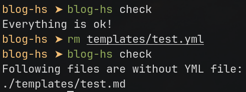
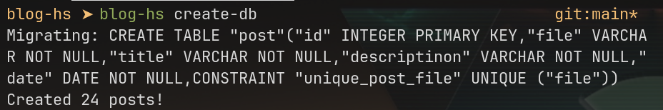

# blog-hs

[Прочитать на русском](./README.ru.md)


A lightweight blog platform, written in Haskell using [Yesod](https://www.yesodweb.com/). 
Using [Redis](https://redis.io/) for caching data and sqlite for providing sorted data.

**This branch does not includes any CSS for web pages. If you're looking for already designed site, check `main-bulma` branch.**

# Features
- Fully SSR! :rocket:
- Posts stored in MD and YAML files
- Sitemap.xml autogeneration
- Internal Redis caching
- Headers ID autogeneration
- [OpenGraph](https://ogp.me) and [JSON-LD](https://json-ld.org/) generation for pages

# TODO

- [ ] Generation of table of contents
- [ ] Option to disable header's id autogeneration

# Table of contents

- [How it works](#how-it-works)
- [Feature details](#feature-details)
- [Usage](#usage)
- [Configuration](#configuration)
- [Deploy](#deploy)
- [License](#lisense)

# How it works

The main idea of project is storing posts of blog in Markdown files in `templates` directory, so the name
of files and folders will be URL of page. Each post consists of two files:
- Markdown file, which includes page content ([sample file](templates/example.md))
- YML file, which inclues information about post like title, image, description etc. ([sample file](templates/example.yml))

For example, post `https://YOURSITE.HERE/post/haskell/how-to-start-yesod` will be stored in files 
`./templates/haskell/how-to-start-yesod.md` and `./templates/haskell/how-to-start-yesod.yml`.

Parsing of markdown file written in [Attoparsec](https://hackage.haskell.org/package/attoparsec) in [`Parser` module](src/Parser/)
and theoretically can be extended. Now, its implemented basic elements of Markdown like headers, lists, code blocks, quotes,
images, links, bold and italic texts.

Result of parsing both files is stored in Redis for one minute. This timing can be changed in [Redis module](src/App/Redis.hs).

Also, blog-hs stores data about posts in SQLite database, which is used for showing latest posts on index page and [generating
sitemap.xml](src/Handlers/Sitemap.hs) file. Database is creating manually using `create-db` command and stores data from YML files.

# Feature details

## Headers automatic ID generation

Currently it is not available for configuration. Each header gets id from its content - images transformed into its alternative
text, text format is ignored. All text is converting into lowercase and gets joined using dash. Punctuation marks is ignored.

Next to each header will be paragraph symbol, which allows to go to this header.

All details specified in [`Parser/Inline.hs`](src/Parser/Inline.hs) and [`Parser/Html.hs`](src/Parser/Html.hs) modules.

```html
# This header will be transformed into this HTML code:

<h1 id="this-header-will-be-transformed-into-this-html-code"> This header will be transformed into HTML code: </h1>
```

Some symbols (like russian alphabet by default) gets translated into english symbols. **All symbols
except this by default will be ignored**. For correcting this behavior see [`transliterateCharacter`](src/Parser/Utils.hs) function.

## Post info

Post info always stored in .yml (*not .yaml*) file with same name and have following fields:

| Field | Type | Description |
|------|-------|-------------|
|name | string | Post title |
|description | string | Post description|
|date | string | Post date in format of "YYYY-MM-DD" |
|images | list of string | Photo URLs list for post preview, opengraph and etc. |

Sample file is [example.yml](templates/example.yml).

# Usage

## Flags

- `-f <PATH>`: sets path for [config file](#configuration)

- `-p <PORT>`: sets port for server to listen. Default is 3000.

## Commands

Blog-hs currently have several commands:

- check: validates existence of YML files for every MD file in `./templates/` directory (note that its relative path and depends
on your working directory).



- create-db: creates (or replaces) SQLite database. Also validates files first.



- run: launches the server.

# Configuration

Configuration file can be passed using [`-f` flag](#flags). In other case, server will take important parameters from environment
variables or will use default values.

| Field in config file | Environment variable name | Usage | Default value |
|----------------------|---------------------------|-------|---------------|
| redisHost | REDIS_HOST | Address for Redis host | localhost |
| redisPort | REDIS_PORT | Port of redis server | 6379 |
| dbPath | DB_PATH | Path of SQLite database | ./blog.db |
| blogDepthLimit | DEPTH_LEVEL | How deep is allowed to go into folders. If request will try to get file deeper than limit, server will response PermissionDenied error. | 1 |
| enableIndexPage | ENABLE_INDEX | Enable index page. If disabled, server will response not found error. | True (1) |
| siteName | SITE_NAME | Short description of your website. Used in OG and JSON-LD | - |
| siteHost | SITE_HOST | Base host of site. For example, "https://mrtstg.ru". No trailing slash at end. Used in generating links. | - |
| robotsFilePath | ROBOTS_TXT_PATH | Path for robots.txt file. | - |

# Deploy

Instead of launching built binary there is way for launch server in Docker container using Docker Compose. 
If you have `make`, you make it using:

```bash
make build-image
make deploy
```

For destroying containers, use `make destroy` command.

This method by default suggests that you will configure server using environment variables. Add volume for config file
if its nececcary.

If you want only to build image, use `make build-image` command.

:exclamation: **Dont forget to correct robots.txt file! It's not getting generated automatically.**

# License

Code is under BSD 3 Clause license. Please have a look at the [LICENSE](./LICENSE) for details.
