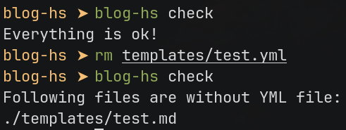

# blog-hs

[Read in English](./README.md)


Легковесная блог-платформа, написанная на Haskell с использованием веб-фреймворка [Yesod](https://www.yesodweb.com/).
Использует [Redis](https://redis.io/) для кэширования данных и SQLite для сортировки данных.

**Эта ветка не содержит каких-либо CSS для веб-страниц. Если вам нужна платформа с минимальным дизайном, посмотрите ветку `main-bulma`.**

# Главные особенности

- Полный Server-side Rendering! :rocket:
- Посты хранятся в Markdown и YML файлах
- Автогенерация sitemap.xml
- Внутреннее кеширование в Redis
- Автогенерация ID заголовков
- Генерация [OpenGraph](https://ogp.me) и [JSON-LD](https://json-ld.org/) для страниц

# TODO

- [ ] Генерация оглавления постов
- [ ] Опция для отключения автогенерации ID заголовков

# Принцип работы

Главная идея проекта - хранение постов блога в Markdown файлах с директории `templates`. 
В качестве URL страницы будут использованы имена директорий и файлов. Каждый пост состоит из двух файлов:
- Markdown файл, который содержит контент страницы
- YML файл, который включает в себя информацию о посте по типу заголовка, изображений, описания и прочего.

Например, пост `https://YOURSITE.HERE/post/haskell/how-to-start-yesod` будет храниться в файлах 
`./templates/haskell/how-to-start-yesod.md` и `./templates/haskell/how-to-start-yesod.yml`.

Парсинг Markdown реализован при помощи библиотеки [Attoparsec](https://hackage.haskell.org/package/attoparsec) 
в [модуле `Parser`](src/Parser/) и теоретически может быть расширен. Сейчас реализованы базовые элементы Markdown, такие как:
- Заголовки
- Списки
- Блоки кода
- Цитаты
- Изображения
- Ссылки
- Форматирование текста (жирный текст и курсив)

Результат парсинга обоих файлов хранятся в Redis одну минуту. Это может быть изменено в [модуле Redis](src/App/Redis.hs).

К тому же, blog-hs хранит данные о постах в базе данных SQLite, которая используется для выборки последних постов на главной
странице и [генерации файла sitemap.xml](src/Handlers/Sitemap.sh). База данных создается вручную при помощи команды `create-db` и
хранит данные из YML файлов.

# Детали реализации

## Автоматическая генерация ID заголовков

В данный момент функция недоступна для конфигурации. Каждый заголовок получает ID исходя из его содержания - изображения преобразуются
в их альтеративный текст, форматирование текста игнорируется. Весь текст приводится к нижнему регистру и соединяется через тире вместо
проблема. Знаки препинания игнорируются.

Рядом с каждым заголовком находится символ параграфа, по которому можно перейти.

Все детали описаны в модулях [`Parser/Inline.hs`](src/Parser/Inline.hs) и [`Parser/Html.hs`](src/Parser/Html.hs).

```html
# Этот заголовок превратится в ID ниже

<h1 id="etot-zagolovok-prevratitsya-v-id-nizhe"> Этот заголовок превратится в ID ниже </h1>
```

Некоторые символы (как русский алфавит по умолчанию) транслитерируются в английский. **Все символы
кроме указаных игнорируются**. Для корректировки поведения изучите функцию [`transliterateCharacter`](src/Parser/Utils.hs).

# Использование

## Флаги

- `-f <ПУТЬ>`: указывает путь для конфигурационного файла

- `-p <ПОРТ>`: указывает порт для сервера. Стандартный - 3000

## Команды

Blog-hs имеет следующие команды:

- check: проверяет наличие YML файлов для каждого в MD файла. Производит проверку в папке `templates` **рабочей директории**.



- create-db: создает (или заменяет) базу данных SQLite. И также производит валидацию файлов.


- run: запускает сервер.

# Конфигурация

Конфигурационный файл передается при помощи флага `-f`. Иначе, сервер получит необходимые параметры из переменных окружения
или будет использовать стандартные значения.

| Поле в конфиге | Имя переменной окружения | Описание | Стандартное значение |
|----------------------|---------------------------|-------|---------------|
| redisHost | REDIS_HOST | Адрес Redis | localhost |
| redisPort | REDIS_PORT | Порт Redis сервера | 6379 |
| dbPath | DB_PATH | Путь к базе данных SQLite | ./blog.db |
| blogDepthLimit | DEPTH_LEVEL | Насколько "глубоко" в директориях можно уйти. Если запрос попытается пройти через слишком большое количество директорий, сервер вернет ошибку. | 1 |
| enableIndexPage | ENABLE_INDEX | Включить главную страницу. Если выключено, сервер вернет 404 ошибку. | True (1) |
| siteName | SITE_NAME | Короткое описание сайта. Используется в OG и JSON-LD | - |
| siteHost | SITE_HOST | Основная часть URL. Например, "https://mrtstg.ru". Без слеша в конце, используется для генерации ссылок. | - |
| robotsFilePath | ROBOTS_TXT_PATH | Путь к файлу robots.txt. | - |

# Развертывание

В качестве альтернативы запуска собранного бинарного файла есть вариант запуска контейнера Docker при помощи Docker Compose.
Если у вас установлен `make`, вы можете сделать это при помощи:

```bash
make build-image # соберет образ контейнера
make deploy
```

Для уничтожения контейнеров, используйте команды `make destroy`.

**Этот метод по умолчанию подразумевает настройку через переменные окружения.**

:exclamation: **Не забудьте откорректировать файл robots.txt! Он не генерируется автоматически.**

# Лицензия

Код распространяется под лицензией BSD 3 Clause. Обратите внимание на файл [LICENSE](./LICENSE).
